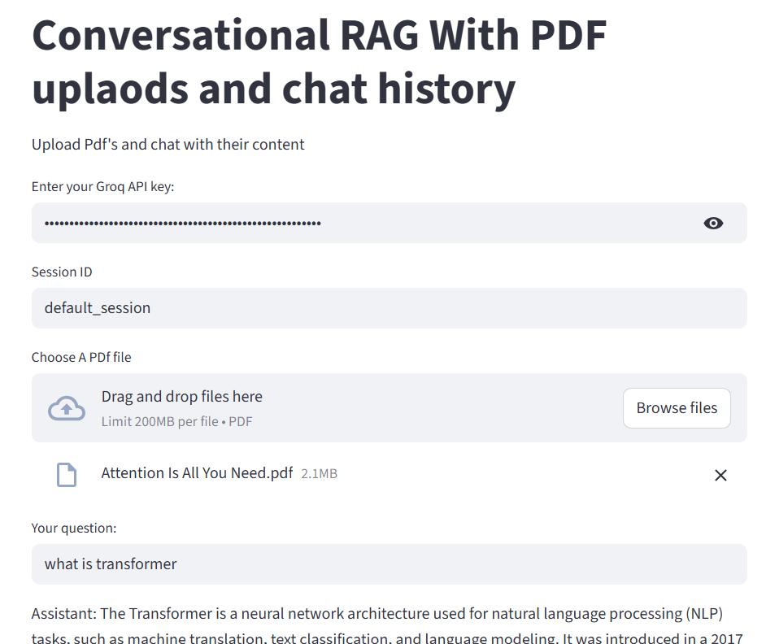
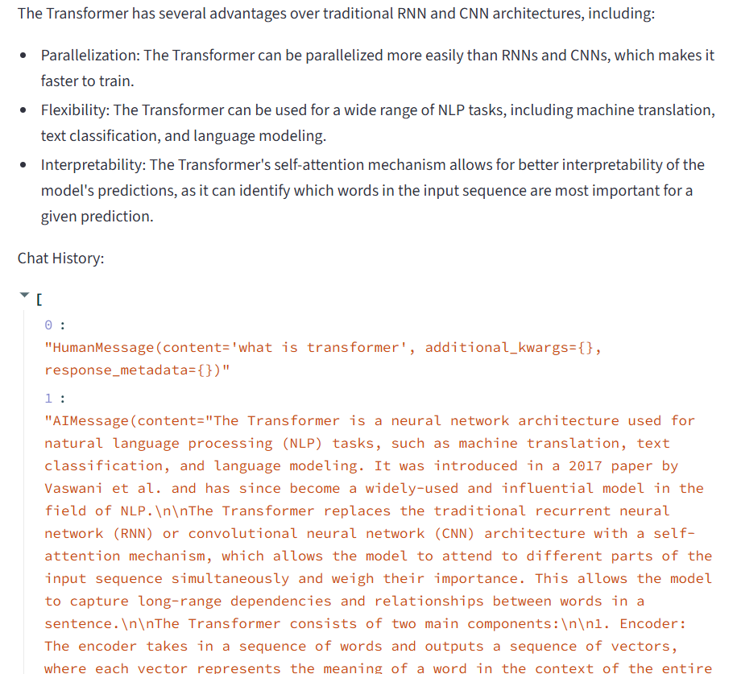

# ChatDoc-AI (🧠 Conversational RAG Q&A System with PDF Uploads and Chat History)

This project implements a **Retrieval-Augmented Generation (RAG)** pipeline that allows users to **upload PDF files** and **chat with their content** through a conversational interface.  
It maintains **chat history**, reformulates follow-up questions contextually, and retrieves accurate answers using **semantic search** and **LLM reasoning**.

---

## 🚀 Features

- 📄 **Upload Multiple PDFs:** Ingest and process multiple documents at once.
- 🧩 **Automatic Chunking:** Splits long text into overlapping chunks for better context handling.
- 🔍 **Context-Aware Retrieval:** Retrieves the most relevant document chunks using semantic similarity.
- 💬 **Conversational Memory:** Maintains session-based chat history for coherent multi-turn conversations.
- ⚙️ **RAG Pipeline:** Combines retriever + LLM for accurate and context-grounded answers.
- 🔑 **Groq LLM Integration:** Uses `llama-3.1-8b-instant` model for fast, high-quality responses.
- 🧠 **Standalone Question Rewriting:** Reformulates follow-up questions into self-contained ones for improved retrieval.
- 🎨 **Streamlit UI:** Simple and interactive interface for chatting with PDFs.

---

## 🧰 Tech Stack

| Component | Technology |
|------------|-------------|
| Framework | [Streamlit](https://streamlit.io) |
| LLM | [Groq API – llama-3.1-8b-instant](https://groq.com) |
| Vector Store | [Chroma](https://docs.trychroma.com/) |
| Embeddings | [Hugging Face – all-MiniLM-L6-v2](https://huggingface.co/sentence-transformers/all-MiniLM-L6-v2) |
| Document Loader | [PyPDFLoader (LangChain)](https://python.langchain.com/docs/integrations/document_loaders/pdf) |
| Memory | [ChatMessageHistory (LangChain)](https://python.langchain.com/docs/modules/memory) |
| Environment | Python 3.10+, dotenv |

---

## 🧱 Project Structure

📦 Conversational-RAG
│
├── app.py # Main Streamlit app
├── requirements.txt # Dependencies
├── .env # Environment variables (HF_TOKEN)
└── README.md # Project documentation

---


---


## ⚙️ Installation & Setup

### 🪄 Option 1: Fork & Run This Project

If you want to run your own copy of this project:

1. **Fork the Repository**
   - Go to the GitHub repository:  
     👉 [https://github.com/DhruvGupta2/ChatDoc-AI](https://github.com/DhruvGupta2/ChatDoc-AI)
   - Click the **“Fork”** button (top-right corner) to create your own copy.

2. **Clone Your Fork**
   ```bash
   git clone https://github.com/<your-github-username>/ChatDoc-AI.git
   cd ChatDoc-AI
   ```


3. **Create a Virtual Environment**
    ```bash
    python -m venv venv
    venv\Scripts\activate       # On Windows
    source venv/bin/activate    # On macOS/Linux
    ```

4. **Install Dependencies**
    ```bash
    pip install -r requirements.txt
    ```

5. **Set Up Environment Variables**
    ```bash
    Create a .env file in the project root and add:

    HF_TOKEN=your_huggingface_api_token
    ```

6. **Run the App**
    ```bash
    streamlit run app.py
    ```

Open in Browser
Visit the local URL shown in the terminal (usually http://localhost:8501
).

---

## 🔑 API Keys Required

You’ll need two keys to run this project:

| API | Purpose | Where to Get It |
|-----|---------|----------------|
| **Hugging Face Token** | Embeddings (`all-MiniLM-L6-v2`) | [https://huggingface.co/settings/tokens](https://huggingface.co/settings/tokens) |
| **Groq API Key** | Access to Llama 3.1 model | [https://console.groq.com/keys](https://console.groq.com/keys) |

You can input the **Groq API Key** directly in the Streamlit interface when prompted.

---

## 💡 How It Works

- **Upload PDFs** → PDFs are parsed into text using `PyPDFLoader`.  
- **Chunk Text** → Long text is split into 5000-character chunks with 500 overlap.  
- **Generate Embeddings** → Each chunk is converted into a numerical vector using Hugging Face embeddings.  
- **Store in Chroma DB** → The embeddings are stored for semantic retrieval.  
- **Ask a Question** → The LLM reformulates the question if needed and retrieves relevant chunks.  
- **Answer Generation** → Llama-3.1 uses retrieved context to generate concise, grounded answers.  
- **Chat Memory** → Conversation history is maintained per session for contextual continuity.

---
## 📸 Screenshots



---

If you find this project useful, please **⭐ star** this repository on GitHub!

---
